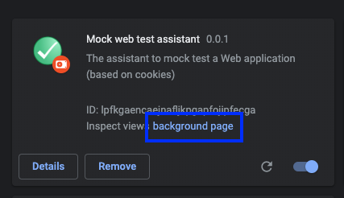

# **Chrome extension**

---

Recently I find out a place where Javascript is extremely useful as well. This is browser (chrome) extensions.
The browser is the tool anyone of us is using most of the time.
It became more and more performant and more and more complete.
But, of course, it could lack the special functionality one can require.
For me this was the case, I needed a special functionality - an extension to improve the polymer/web components mock based testing.
I will explain, gradually, in this chapter how to create a chrome extension from hello chrome extension world to the mock-enhancer extension.

**The requirements for the mock-enhancer chrome extension:**

- find out a specific site cookies and modify/create it with a value provided by user (combo box)
- find out the tab with a specific URL (the mocked application) and refresh it
- create an extension option to setup the gitlab personal token
- checkout a specific file from gitlab
- store and retrieve from sync store the gitlab personal token
- (bonus) create a shortcut for the chrome extension popup
- (bonus) create a shortcut to duplicate the current tab

Another important aspect that I'm going to talk about is debugging a chrome extension

## **Hello chrome extension world application**

## **How to structure the extension**

## **Create/update a site cookie**

## **Find out a tab, make it current and refresh it**

## **Create a chrome option**

For this extension it is required to fetch a file from gitlab. In order to use the gitlab REST API the Gitlab personal token is require.
See [here](htttp://todo.com) how to generate the gitlab personal token

To allow the user to setup his/her gitlab personal token the best way of doing this is through continue from here

## Store/retrieve information to/from sync store

## **How to use an js library using ES 6 module**

## **How to debug a chrome extension**

It is a given the fact that there a quite many moments when an application doesn't work the way we like.
In this moments it is important to now how to debug the extension.

### **Print information to the console**

The first and most straightforward way of doing this is to see log the information in the chrome console.
But unfortunately this doesn't work the way we know when developing web application.

### **Developer tool for the backgroung page**

The entry point of extension is backgroung page. So there are many times we want to inspect it. In order to do this we need to:

- go to `chrome://extensions`

- in the extension panel click on the background page
  Having developer tools open we can inspect any elements related to the background script.
  Any console.log in the background script are displayed in developer tools console

  show the code in backgroung.js with console.log

  show the console in developer tools with the logged information
