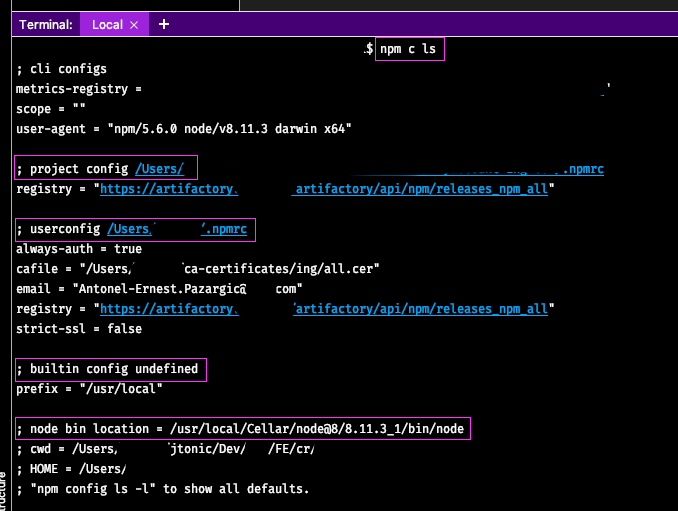

# How to use help?

---

- Get help about the npm command

```sh
    $ npm -h
    $ npm --help
```

<br/>

- Get a quick help about an npm command

```sh
  $ npm install -h
```

<br/>

- Get a comprehensive information about a npm command

```sh
  $ npm help install
```

<br/>

- Search in help topics

```sh
  $ npm help-search remove
```

<br/>

## Npm scripts

Npm scripts are included in the scripts property in package.json

- run a script

```sh
  $ npm run my_script
```

<br/>

- There are some popular scripts for which there are some shortcuts

```sh
  $ npm run start -> $ npm start
  $ npm run test -> $ npm test | npm tst | npm t
```

<br/>

- npm list scripts

```sh
	$ npm run
```

<br/>

Npm commands used (regularly) in scripts resides in ./node_modules/.bin (e.g.: mocka, prettier, eslint, uuid).

E.g: Running the following command in the project home directory creates a new UUID

```javascript
    $ uuid v1 => af5ccf30-4d48-11e9-9ade-6dad5455bcd3
```

<br/>

## Create a new JS npm-based project

A new npm based project can be created with one the following commands

```sh
  $ npm init
  $ npm init -y    # with all the default values accepted
```

- setting the init value (used by npm init)

```sh
  $ npm set init-author-name ‘Antonel-Ernest Pazargic’
  $ npm config set init-author-name ‘Antonel-Ernest Pazargic’
```

<br/>

- See this documentation for all the init values to setup.

Go to [npm config](https://docs.npmjs.com/misc/config) and search for `init-`

Or better go to one of the [npm init configurations](https://docs.npmjs.com/misc/config#init-author-name)

<br/>

> All npm user-scoped settings/config are in the ~/.npmrc

- Getting an init value

```sh
  $ npm get init-author-name
  $ npm config get init-author-name
```

<br/>

- delete a default value for npm init

```sh
  $ npm config delete init-author-name
```

<br/>

## Npm configuration

- Show npm configuration (what is in the ~/.npmrc and more)

```sh
$ npm config list
$ npm c ls
```

The result looks like



<br/>

- Is is possible to see all default values with the following command.

```sh
  $ npm c ls -l
```

This is very useful to see what configuration is available for changing (note: some configurations are read-only).

Moreover the changed configuration are marked as (overriden). See below how a changed init configuration looks like:

```text
init-author-email = "Antonel-Ernest.Pazargic@ing.com"
; init-author-email = "" (overridden)
```

<br/>

- Useful configuration

  - save-exact (install the latest version exactly)

    ```sh
    $ npm c set save-exact=true
    ```

  - --save (-S) by default
    ```text
    npm c set save=true
    ```

<br/>

## Module dependencies

- install dependencies

  - in production code (using --save/-S/--save-prod/-P - command option)
    ```sh
    $ npm install lodash --save
    $ npm i lodash -S
    ```

<br/>

- in devDependencies (using --save-dev/-D command option)

  ```sh
  $ npm install karma --save-dev
  $ npm i karma -D
  ```

<br/>

- install a npm package from a local directory
  ```sh
  $ npm i -S ../npm1
  ```

<br/>

- install a npm package from a git repo (github)

  ```sh
  $ npm install https://github.com/jtonic/js-for-beginers.gitt#master --save
  $ npm install jtonic/js-for-beginners#master --save
  ```

<br/>

- remove dependencies no longer needed

During the development there are times when some no more wanted packages are still in the node_modules, but they are no longer in the package.json.
In order to do a package cleanup

```sh
$ npm prune
```

And when preparing the production code

```sh
$ npm prune --production -> no more --save-dev dependencies in the node_modules
```

<br/>

- List the installed packages

```sh
$ npm list  # or ll or la
$ npm list --depth 0 # shows only the first dependencies level (the ones declared in the package.json. No transient dependencies)
```

<br/>

- list only dev dependencies

```sh
$ npm list --depth 0 --dev true  # or --prod true
```

- parseable format -> to see where the global dependencies resides in

```sh
$ npm list --depth 0 --global true --parseable true
```

> Note: -g ⇔ --global true

<br/>

## Npm registry

In [registry](https://www.npmjs.com) we can search for a package, e.g.
[lodash](https://www.npmjs.com/package/lodash)

<br/>

- How to see the package.json information?

  http://registry.npmjs.org/lodash (or http://npm.im/lodash )

> Note: In order to see the json pretty formatted you can install a browser add-on, extension.

For Opera I've installed json-lite https://addons.opera.com/en/extensions/details/json-lite/

<br/>

## Publishing a package

- sign up on npmjs.com

- register the npmjs.com username
  `$ npm adduser`

- create a new folder, say ‘my-test-package’ and make it current

- create a new github.com repository on https://github.com/{userName}

- enable VCS (git)
  `$ git init`

- add git remote repository

```sh
$ git remote add origin https://github.com/jtonic/my-test-package.git`
```

- create a username (or organization name) scope package json file

```sh
$ npm init --scope=@npm_username
$ git add .
$ git commit -m ‘Initial commit’
$ git push origin master
```

- publish to npmjs registry
  `$ npm publish --access public`

- See the information about the published package
  `$ npm info @jtonic/my-test-package`

- See the github repo of the npm package
  `npm repo @jtonic/my-test-package`

- Or see the package info in browser http://registry.npmjs.org/@jtonic/my-test-package

- Create a git tag
  `git tag 0.1.0`

- Push tag to origin/master
  `git push --tags`

- Updating the npm package to a new patch version

  - Do whatever changes is required

  ```sh
  $ npm version patch  // this changes the version in package.json, commit the change and make a tag
  $ git push
  $ git push --tags
  $ npm publish --access public
  ```

## Versioning the npm package

See the [semantic versioning](http://semver.org)

`M.m.p.x (1.12.224)`

M - major - 1

m - minor - 12

p - patch - 224

    To better keep in mind the version elements semantics

`B.F.Bf.x`

M major -> B break

m minor -> F feature

p patch -> Bf bug fix

> <span style="color: red">Continue formating from here

How to see the version of the current npm module (plus node, npm and other packages version).

```sh
$ npm version
```

- Bump the version

```sh
$ npm version patch -> increase the patch version segment
$ npm version $my_version -> setup a specific version
```

How easy is to work with both application and a dependency using npm link

Let’s suppose we have an nodejs application and a dependency my-test-package (both of them as npm module).
The case is: the (new version of) dependency is not quite tested, or the application is its first client and we want to test the dependency through the my-app client.

The classic way of doing this is
either publish the dependency in npm registry whenever it is modified and pick it up in the my-app (which is quite cumbersome because we have to deal with versioning), and end up having a lot of intermediary versions in npm registry. HIGHLY UNRECOMMENDED.
either to version control the dependency (git) and add/commit/push all minor changes, but this requires a lot of git add, commit, push (proliferation of the commits)
modify directly the files in the $my-app/node_modules/$path-to-my-test-package, but this requires to keep the track of all changes in order to replicate them in the my-test-package npm package. This could lead to issues when something in the node_modules is not picked up.

A more straightforward of doing this is using the npm link.

Note: In examples below we have a scope for my-test-package (@jtonic) which is useful for scoping npm packages in npm registry. For simple cases (or when npm package resides only in git repo - github) you can leave it out.

Steps:
in my-test-package home dir
$ npm link
test the link
$ npm ls -g --depth 0
in my-app home dir
\$ npm link @jtonic/my-test-package
after this command completed we have:
the dependency in ./node_module/@jtonic
no entries in the dependencies section in package.json if the dependency was not yet there already
No whenever we modify something in the my-test-package dependency (thanks to the symlink) the change is automatically seen in the my-app module/package

    As soon as we find that the my-test-package is the way (stable) we like it to be it is time to replace the link and use the correct dependency. Follow these steps to do this:

in my-test-package home dir git commit changes, and npm publish the new version (say. 0.1.1)
$ git add .
$ git commit -m ‘some changes’
$ git push
$ npm version patch
$ git push # to push the commits created by npm version patch
$ git push --tags # to push the tag created by npm version patch
$ npm publish --access public
in my-app home dir
$ npm uninstall --no-save @jtonic/my-test-package
[optional] npm info @jtonic/my-test-package version
[optional] npm info @jtonic/my-test-package dist-tags
$ npm i --save  @jtonic/my-test-package@0.1 # to force latest patch version
in my-test-package
$ npm uninstall # delete global symlink

See here for a more comprehensive explanation:

## Semantic versioning and npm

`^4.0.0` -> `^` will use the latest minor version. Supposing 4.17.11 is the one then
npm update
$ npm i -S lodash@4.0.0 	-> lodash: ^4.11.1 in package json
$ npm up -S lodash -> lodash: ^4.17.11 in package.json and npm ls -S --depth=0 --long=true

~3.7.2 -> ~ will use the latest major version. Supposing it is 4.17.11
\$ npm up -S lodash -> lodash: ^4.17.11 in package.json and npm ls -S --depth=0 --long=true

Use ~ with great care because it could break the code.

Show the information about a package

- full output

```sh
$ npm info lodash
```

- show only a specific section, such as versions

```sh
$ npm info lodash versions  # show versions history
$ npm info lodash dist-tags.latest # show the latest version
```

List the globally installed packages

    $ npm list --global true --depth 0
    $ npm list --global true --depth 0 --long true  # further information about the package (home page, git repo, etc)

## Miscellaneous npm commands

- open the VCS repo of the module in default browser

```sh
$ npm repo lodash # opens the browser with the source  code repo of lodash
```

- Execute npm command in silent mode (-s/--silent)

```sh
$ npm test --silent # or -s
```

- How to enforce the node and npm versions in npm package. In package.json add the following:

```json
"engines": {
  "node": "~8.11.4",
  "npm": "~5.6.0"
},
```

## Useful links

https://docs.npmjs.com/misc/config#shorthands-and-other-cli-niceties
https://docs.npmjs.com/misc/scripts
