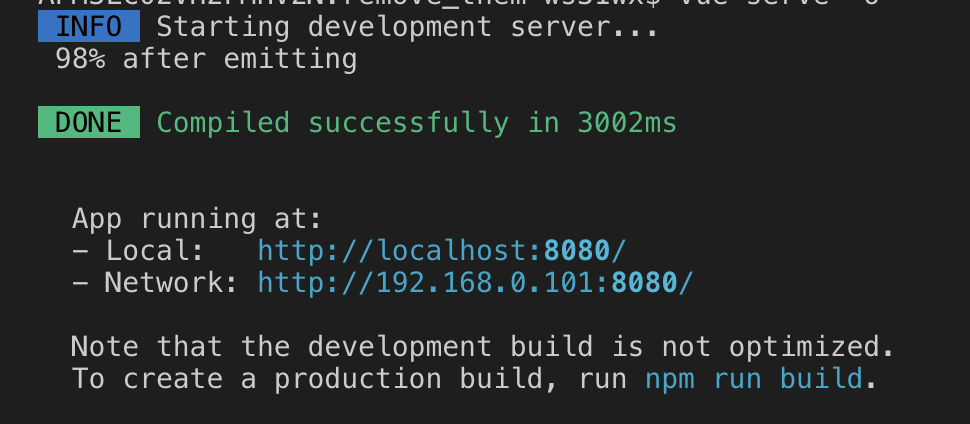

# <span style='color:#61AEEE'>Generating a Vue application with vue-cli 3

Vue cli is a professional project generator for VueJS.
It allows:

- to instant prototype with zero configuration
- to create a project which:
  - can be run in development mode
  - can be build to different artifacts with `vue build`
    - application
    - vue component
    - web component
    - a bundle of web components
  - allows allows fully customisation (no eject is required)

**Notes:**

> Vue CLI requires Node.js version 8.9 or above (8.11.0+ recommended)
> In this material I am going to use vue cli version is 3.x

## <span style='color:#61AEEE'>Instant prototyping

You just have an idea and you want to quickly materialize it, vue cli instant prototyping is the tool you need.

What is needed? The packages below has to be installed globally.

- @vue/cli
- @vue/cli-service-global

### How to prototype a vue application?

- Install the aforementioned packages globally with the following commands:

```sh
$ npm i -g @vue/cli
$ npm i -g @vue/cli-service-global
```

- Check their installation:

```sh
$ vue --version
```

On my machine the outcome of the command is `3.8.4`

- Create a file `App.vue`

```html
<template>
  <h1>Hello!</h1>
</template>
```

- run the command:

```sh
$ vue serve -o
```

This starts a development server and install (serve) the App.vue vuejs application and (because of `-o` command argument) opens the default browser pointing to `http://localhost:8080`.

If all goes fine the Hello message is displayed in the console/terminal.



and the Hello! message is displayed in the browser opened tab.

Notes:

> In case the cli-service-global not installed globally a warn is issued when run `vue serve`

> `Command vue serve requires a global addon to be installed. Please run npm install -g @vue/cli-service-global and try again.`

The `vue serve` uses the same default setup as projects created by vue create

When running `vue serve` it automatically infers the entry file in the current directory - which can be one of _main.js, index.js, App.vue or app.vue_

If serving another file, say `MyProtoComponent.vue`, is wanted, the following command can be used.

`$ vue serve MyProtoComponent.vue -o`

### Build for production

Vue cli allows to build for production with zero configuration.

I really recommend to create a project with `vue create` command when the intention is to go for production but **instant prototyping** allows to build vue js artifact for production with zero customization.

The command is

`$ vue build`

To see what command options are available you could run `vue build --help`

One of the main option is the target of the build wich means what type of artifact the command will produce.

There are the following options for target.

- app - which is the default
- lib - produce a vue component
- wc - produce a Web Component
- wc-async - producing a bundle of Web Components

<span style="color:red"> Example here with Web Component artifact

## <span style='color:#61AEEE'>Create a new project

<span style="color:red"> TBD
