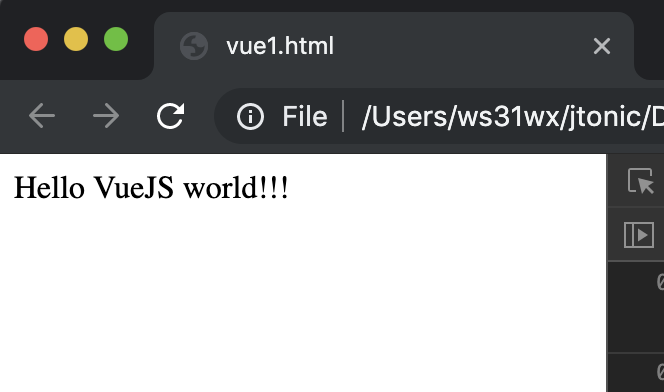
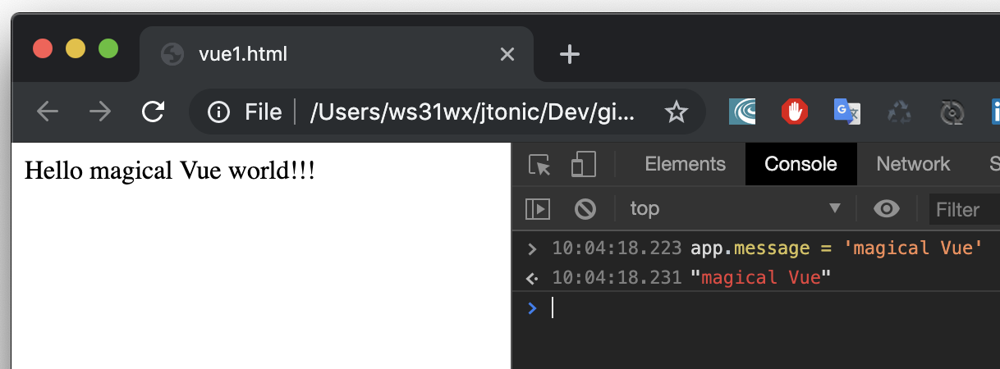
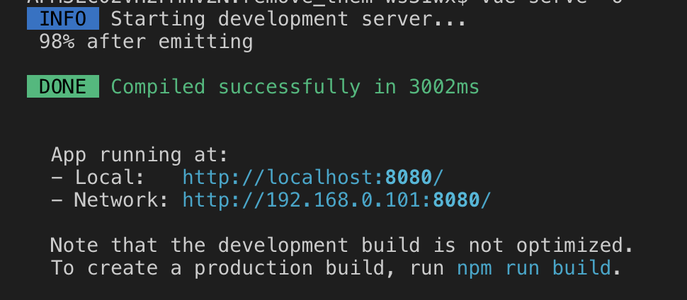

# <span style='color:#61AEEE'> VueJS

---

I heard many times a lot about these 3 frameworks :

- Angular,
- React,
- VueJS (most recently),

icluding tutorials, comparisons articles, examples.

I must admit that Angular was the first king of the JS kingdom, but soon after it was time for React to reign. Most recently Vue is threatening the React's throne.

So, for me it was obvious it wasn't gonna be an easy task to decide what framework out of 3 to start learning first.

But, fortunately, I joined the **One app 3 frameworks** Voxxed Days Bucharest Frontend 2019 workshop.

The workshop was about developing the same web applications in all 3 frameworks: Angular, React and Vue.

The presenter who talked about the Vue started his presentation (more or less) with

> I am mainly a BE developer and was looking for a simple web library/frontend for developing the web application.
> After getting my feet wet with all 3 popular frameworks it was clear to me it is Vue I have to go further with".

I found myself in the same situation as VueJS presenter, and considering the explanations I was given by him about why did he consider VueJS as a best option for developing web, I decided to start learning Vue first.

## <span style='color:#61AEEE'> What is Vue?

Vue was created by **Even You**.

As per Vue description on vue js home page, Vue is a

- approachable,
- versatile,
- performant

  javascript framework.

It allows you to create a maintenable and testable web application.

Vue is a progressive javascript framework.

Vue is thought in such a way that it could be included in an existing framework bit by bit.

So you don't have to rewrite the entire application in one shot but you include vue progressively.

Moreover Vue allows to take a web application frontend and split it up in reusable components, each of them containing javascript, html and css needed to render that piece of the page.

_Another very important trait of Vue it's reactivity._
Vue reactivity means that whenever the underlying data changes the UI rendering that piece of data changes as well to display the latest data value.

## <span style='color:#61AEEE'> Hello world Vue web application

The more professional way of starting a Vue application is by using vue cli.

But this is not the recommended way when the trainee is not acquainted to javascript tooling (node, npm, babel, webpack...)

Moreover the official quick Vue guide also recommends to start learning Vue without generating it.

Without further ado lets see how the most simple Vue application looks like.

Basically it is all about having the following html file (index.html)

```html
<html>
  <head>
    <script src="https://cdn.jsdelivr.net/npm/vue/dist/vue.js"></script>
  </head>

  <body>
    <div id="app">Hello {{ message }} world!!!</div>

    <script>
      app = new Vue({
        el: "#app",
        data: {
          message: "VueJS"
        }
      });
    </script>
  </body>
</html>
```

Let's dissect a bit this file.

- first the UI element in which the vue component/application is redered in - `<div id='app'` => This div is chosen by vue by the `el` argument passed to the Vue
- secondly a new Vue application instance is created in a `<script>` html tag which has to be at the end of the html.
- there are 2 object arguments passed to the Vue constructor.
  - el => identifies the UI element where the Vue application/component is rendered in. **This is mandatory**.
  - data => data that is rendered in the UI by the component/application.
    This is not mandatory.
- templating -> `{{ message }}`. This templating element is placed inside the div element. This is going to be replaced by the message property of the vue instance data.
  So, the end result, rendered in the browser is `Hello VueJS world!!!`

As I said one of the major traits of Vue is **reactivity**, meaning that whenever the underlying data is changed the UI element is rerendered to reflect the change.

So, in hello vue world example we can experiment this reactivity.

Before:



Open the Google Chrome developer tools (console tab) and write:

```
app.message = 'magical Vue'
```

then press ENTER.

The change is reflected in the application as pe the image bellow.


## <span style='color:#61AEEE'> The main moving parts a Vue application consists of

- directives and modifiers
- filters
- lifecycle hooks
- mixins
- whatchers and computed properties

## <span style='color:#61AEEE'> Passing data from parent component to child component

## <span style='color:#61AEEE'> Vue component/application lifecycle hooks

## <span style='color:#61AEEE'> Generating a Vue application with vue-cli 3

Vue cli is a professional project generator for VueJS.
It allows the generation of a project that:

- could be a instant prototype
- allows fully customisation
- <span style="color:red"> further info

It also allow simple prototyping.
The only packages needed to be installed (globally are) for protoptyping are:

- @vue/cli
- @vue/cli-service-global

How to prototype a vue application?

- Install the aforementioned packages globally with the following commands:

```sh
$ npm install -g @vue/cli
$ npm install -g @vue/cli-service-global
```

- Check the installation:

```sh
$ vue --version
```

On my machine the outcome of the command is `3.8.4`
**Note:**

> The required vue cli version is 3.x

- Create a file `App.vue`

```html
<template>
  <h1>Hello!</h1>
</template>
```

- \*run the command:

```sh
$ vue serve -o
```

This starts a development server and install (serve) the App.vue vuejs application.



Note:

> In case the cli-service-global not installed globally a warn is issued when run `vue serve`

> `Command vue serve requires a global addon to be installed. Please run npm install -g @vue/cli-service-global and try again.`

**What is a single file Vue components?**

The professional way of creating a vue application is by Generating (scaffolding) it with the command-line interface (vue-cli)

The single file containing httml, javascript and css has the extension .vue.

**Notes:**

> For those who likes having the httml, css and javascript in a separate files Vue offers this by allowing to include the references to these files in the \*.vue file. See the example below.

```html
<template src="./footer.component.html"></template>
<script src="./footer.component.js"></script>
<style src="./footer.component.scss" scoped lang="scss"></style>
```

[More about single file view components](https://vuejs.org/v2/guide/single-file-components.html)

## <span style='color:magenta'> State management with Vuex

How to declare state?

Vuex is a vue plugins. We have to do the following to setup it in a vue application:

1. fetch the plugin from npm registry

   `npm i --save vuex`

2. import the vuex module

   `import Vuex from "vuex";`

3. set it up


    `Vue.use(Vuex);`

4.  create a store

    ```javascript
    const store = new Vuex.Store({
      state: { ... }
    });
    ```

5.  reference the store in the new Vue instance

    ```javascript
    new Vue({
      render: h => h(App),
      store
    }).$mount("#app");
    ```

**See below the full example:**

```javascript
import Vue from "vue";
import Vuex from "vuex";
import App from "./app/App.vue";

Vue.config.productionTip = false;

Vue.use(Vuex);

const store = new Vuex.Store({
  state: {
    message: "VueJS"
  },
  getters: {
    message(state) {
      return state.message;
    }
  },
  mutations: {
    changeMessage(state, payload) {
      state.message = payload;
    }
  },
  actions: {
    changeMessageAction(state, payload) {
      state.commit("changeMessage", payload);
    }
  }
});

new Vue({
  render: h => h(App),
  store
}).$mount("#app");
```

**How to reference state from a component computed property?**

Considering the store declaration above the `message` state property from the store can be referenced in a component computed property like:

```javascript
computed: {
  message() {
    return this.$store.state.message;
  }
}
```

## <span style='color:#61AEEE'> Routing (Vue-Router)

## <span style='color:#61AEEE'> Creating and publishing on npm ... of a custom vue component

## <span style='color:#61AEEE'> Debugging a Vue application

## <span style='color:#61AEEE'> An example application

The application would use some VueJS components to:

- home page
- authenticate (SSO with Github)
- authorize (OAuth2)
- TODO list
  - create/delete/edit a new TODO list
  - add/edit/delete/mark complete a TODO task
  - due time for the task

## <span style='color:#61AEEE'> Further readings

[Vue official documentation](https://vuejs.org/v2/guide/)

[VueX](https://vuex.vuejs.org/guide/)

[NuxtJS](https://nuxtjs.org/guide/installation)

[Vue CLI](https://cli.vuejs.org/guide/prototyping.html)

[Vue.js Quick Start Guide - Packt](https://subscription.packtpub.com/book/application_development/9781789344103)
